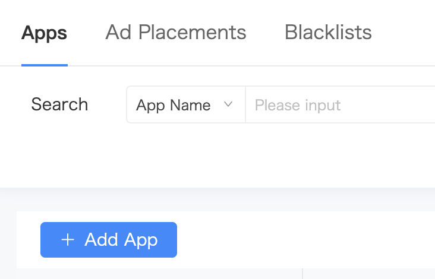
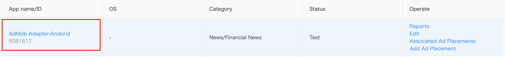
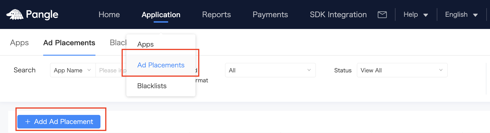
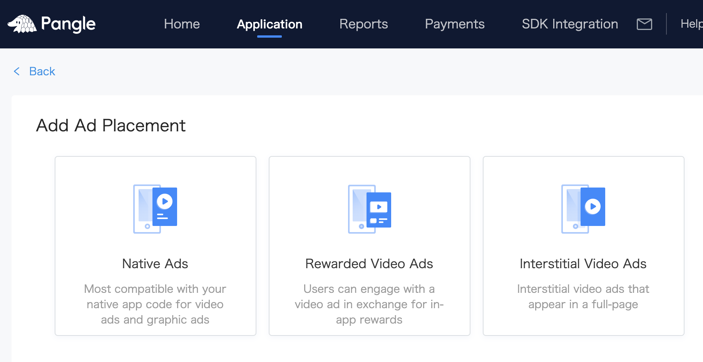
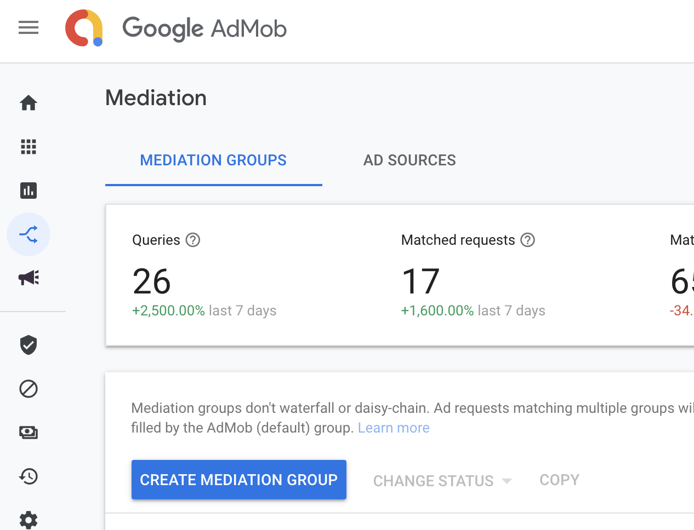
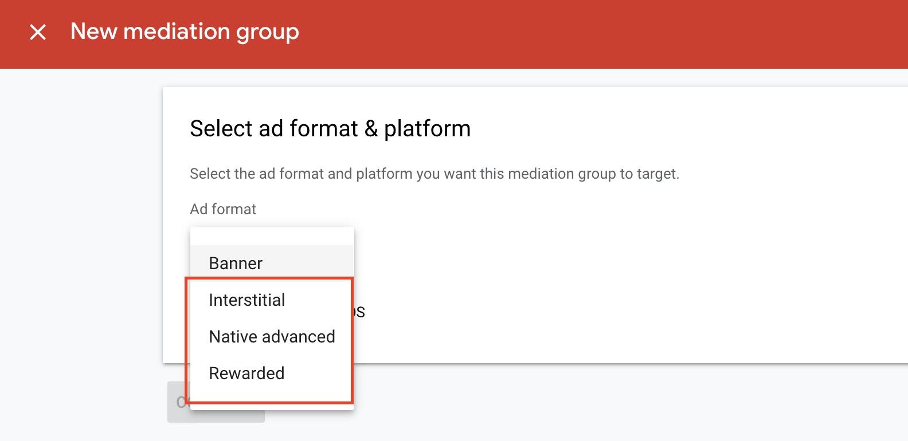
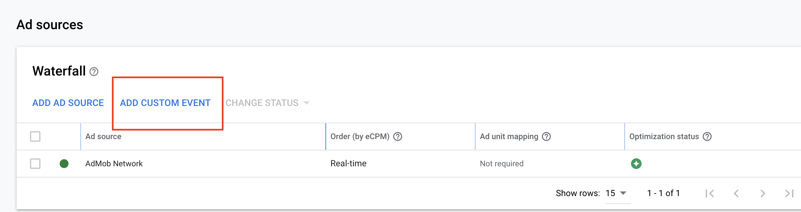
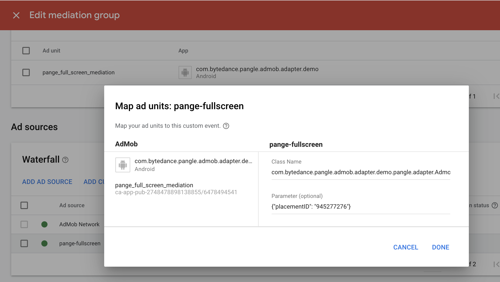
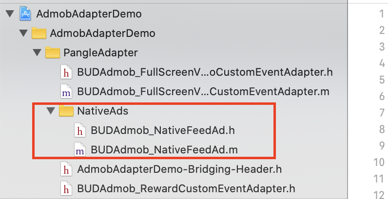
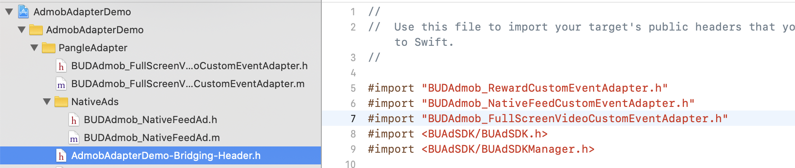

# AdMob Custom Event Adapter for Pangle

> Please set [Admob](https://developers.google.cn/admob/android/quick-start) in your app first.

* [Setup Pangle Platform](#setup-pangle)
* [Add Pangle to AdMob's mediation](#add-pangle)
* [Initialize Pangle SDK and Adapter](#import-pangle)

## Setup Pangle Platform
### Create a Pangle account

- Please create a [Pangle account](https://ad.oceanengine.com/union/media/login) if you do no have one.

### Create an application and placements in Pangle

- Click `Apps` -> `+ Add App` to create a app for mediation.

- You will get an app with its `app ID`.

### Create Ad Placement
- Click `Ad Placements` -> `+ Add Ad Placement` to create the placement for mediation.

- Select the ad's type for your app and finish the create.

- You will get a placement with its `placement ID`.

## Add Pangle to AdMob's mediation

### Create mediation

- Click `Mediation` -> `CREATE MEDIATION GROUP` to create a mediation group.

- Select the same ad format which created on Pangle side.

- After select the ad unit you created on AdMob which you want to embed mediation, click `ADD CUSTOM EVENT` to set with Pangle.

- Set info

 - **Class Name**: the adapter class's name , for example,`BUDAdmob_RewardCustomEventAdapter`

 - **Parameter**: Add {"placementID": "[your placement ID on Pangle](#placementID)"} to Parameter.

- Add adapter's class name to Class Name.

- Add {"placementID": "your slot ID"} to Parameter.

**Please make sure to use JSON to set Parameter. Or you need to customize adapter yourself.**

## Initialize Pangle SDK and Adapter

### Initialize Pangle SDK
- Please refer to [SDK Integration](https://partner.oceanengine.com/union/media/union/download/detail?id=2&osType=ios) to intergrate Pangle SDK in your application.

 * **Please use [app ID](#app-id) to initialize Pangle SDK.**

### Embed Pangle Adapters
- You can find Adapters for different ad formats [here](https://github.com/guchan-fout/iOS-pangle-admob-custom-adapter/tree/master/AdmobAdapterDemo/PangleAdapter) , embed them in your app and they can be used with no code changes. Also you can customize it for your use case. You can find simple use cases from [Demo](https://github.com/guchan-fout/iOS-pangle-admob-custom-adapter/tree/master/AdmobAdapterDemo).

- You need to add these two files into your project to support native ad's adapter [mapping](https://developers.google.com/admob/ios/native/native-custom-events#map_native_ads).

### About Swift
- If your project is based on Swift, please add adapter's header file into your bridge-header file.

