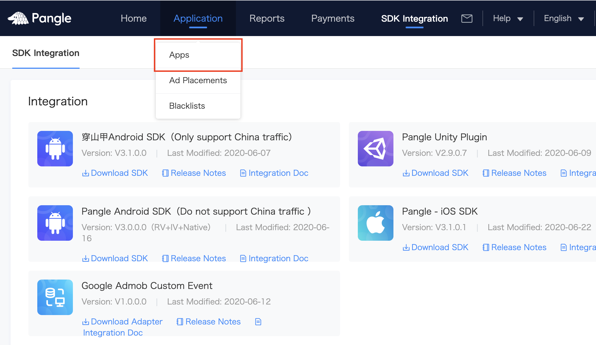
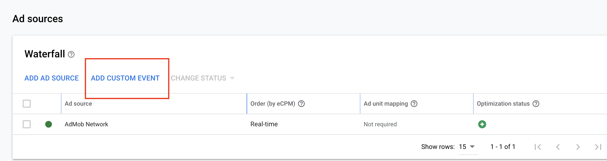
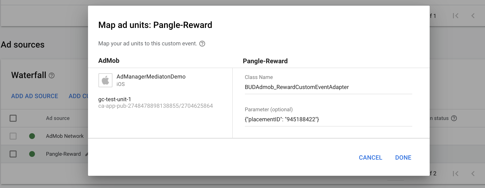
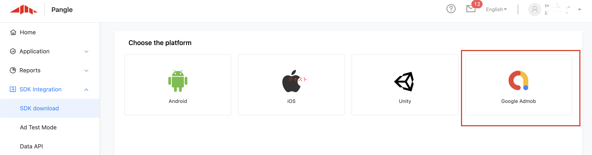
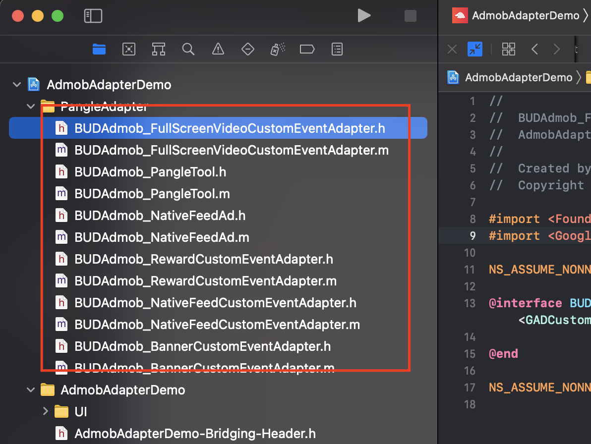

# AdMob Custom Event Adapter for Pangle

> Please set [Admob](https://developers.google.com/admob/ios/quick-start) in your app first.

* Required Steps for integration
  * [Setup Pangle platform](#setup-pangle)
  * [Add Pangle to AdMob's mediation](#add-pangle)
    * [Adapters for different ad formats](#adapter-file)
  * [Initialize Pangle SDK and adapters](#import-pangle)
    * [Pangle SDK's integration and initialize](#import-sdk)
    * [Embed Pangle adapters](#import-adapter)
        * [CocoaPods](#import-adapter-pod)
        * [Manual Download](#import-adapter-manual)
* [About Swift](#adapter-swift)
* [Demo](#adapter-demo)

<a name="setup-pangle"></a>
## Setup Pangle Platform
### Create a Pangle account

- Please create a [Pangle account](https://www.pangleglobal.com) if you do no have one.


### Create an application and placements in Pangle

- Click `Apps` -> `+ Add App` to create a app for mediation.
<br>

<br>


<a name="app-id"></a>
- You will get an app with its `app ID`.
<br>


### Create Ad Placement
- Click `Ad Placements` -> `+ Add Ad Placement` to create the placement for mediation.
<br>


- Select the ad's type for your app and finish the create.
<br>


<a name="placementID"></a>
- You will get a placement with its `placement ID`.
<br>


<a name="add-pangle"></a>
## Add Pangle to AdMob's mediation

### Create mediation

- Click `Mediation` -> `CREATE MEDIATION GROUP` to create a mediation group.
<br>


- Select the same ad format which created on Pangle side.
<br>


- After select the ad unit you created on AdMob which you want to embed mediation, click `ADD CUSTOM EVENT` to set with Pangle.
<br>



- Add adapter's class name to Class Name.
    - **Class Name**: the adapter class's name , for example,`BUDAdmob_RewardCustomEventAdapter`

- Add `{"placementID":"your slot ID"}` to Parameter.
    - **Parameter**: Add {"placementID":"[your placement ID on Pangle](#placementID)"} to Parameter , for example,`{"placementID": "1234567"}`
<br>


  - **Please make sure to use JSON to set Parameter. Or you need to customize adapter yourself.**

<a name="adapter-file"></a>
### Class name for different ad formats

|  Ad Type  |  Class Name  |
| ---- | ---- |
|  Reward Video Ads  |  BUDAdmob_RewardCustomEventAdapter  |
|  Interstitial(Fullscreen Video) Ads  |  BUDAdmob_FullScreenVideoCustomEventAdapter  |
|  Banner Ads  |  BUDAdmob_BannerCustomEventAdapter  |
|  Native Ads  |  BUDAdmob_NativeFeedCustomEventAdapter  |


<a name="import-pangle"></a>
## Initialize Pangle SDK and Adapter

<a name="import-sdk"></a>
### Import and Init Pangle SDK
Add the information as follows in Podfile, and using `pod update` or `pod install`  to intergrate.
```
pod 'Ads-Global'
```

Initialize Pangle with the APP ID as the argument. Unless there is a particular reason, stipulate as

**UIApplicationDelegate application(_:didFinishLaunchingWithOptions:)**

```swift
func application(_ application: UIApplication, didFinishLaunchingWithOptions launchOptions: [UIApplicationLaunchOptionsKey: Any]?) -> Bool {

    BUAdSDKManager.setAppID("your_app_id")

    return true
}
```

Please refer to [Integrate Pangle SDK](https://www.pangleglobal.com/help/doc/6034ac60511c57004360ff72)
and [Initialize Pangle SDK](https://www.pangleglobal.com/help/doc/6034ac73511c57004360ff76) for manual integration and more information.

<a name="import-adapter"></a>
### Embed Pangle Adapters


<a name="import-adapter-pod"></a>
#### CocoaPods (preferred)
From our adapter v1.4.1, we support CocoaPods integration, and this is the prerequisite for using it.

- Pangle SDK 3.7.0.0 or higher
- Google-Mobile-Ads-SDK 8.0.0 or higher

Add the information as follows in Podfile, and using `pod update` or `pod install`  to intergrate.
```
pod 'Pangle-adapter-for-admob'
```

<a name="import-adapter-manual"></a>
#### Manual download
- Click `SDK Integration` -> `SDK download`, you can download adapters for different ad formats from your Pangle platform.
<br>

<br>


Please unzip the file and add adapter files from iOS folder into your application project. They can be used with no code changes. Also you can customize it for your use case.
* You need to add `BUDAdmob_NativeFeedAd.h` and `BUDAdmob_NativeFeedAd.m`  into your project to support native ad's adapter [mapping](https://developers.google.com/admob/ios/native/native-custom-events#map_native_ads).




<a name="adapter-swift"></a>
## About Swift
- If your project is based on Swift, please add adapter's header file into your bridge-header file.
<br>


<a name="adapter-demo"></a>
## Demo
- You can find simple use cases from [Demo](https://github.com/bytedance/Bytedance-UnionAD/tree/master/Demo).
