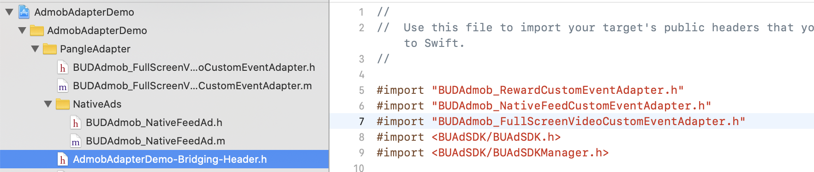

# AdMob Custom Event Adapter for Pangle

> Please set [Admob](https://developers.google.com/admob/ios/quick-start) in your app first.

* [Setup Pangle Platform](#setup-pangle)
* [Add Pangle to AdMob's mediation](#add-pangle)
* [Initialize Pangle SDK and Adapter](#import-pangle)

## Setup Pangle Platform
### Create a Pangle account

- Please create a [Pangle account](https://ad.oceanengine.com/union/media/login) if you do no have one.

### Create an application and placements in Pangle

- Click `Apps` -> `+ Add App` to create a app for mediation.
 

 

- You will get an app with its `app ID`.
 

### Create Ad Placement
- Click `Ad Placements` -> `+ Add Ad Placement` to create the placement for mediation.
 

- Select the ad's type for your app and finish the create.
 

- You will get a placement with its `placement ID`.
 

## Add Pangle to AdMob's mediation

### Create mediation

- Click `Mediation` -> `CREATE MEDIATION GROUP` to create a mediation group.
 

- Select the same ad format which created on Pangle side.
 

- After select the ad unit you created on AdMob which you want to embed mediation, click `ADD CUSTOM EVENT` to set with Pangle.
 

- Add adapter's class name to Class Name.
    - **Class Name**: the adapter class's name , for example,`BUDAdmob_RewardCustomEventAdapter`

- Add `{"placementID":"your slot ID"}` to Parameter.
    - **Parameter**: Add {"placementID":"[your placement ID on Pangle](#placementID)"} to Parameter , for example,`{"placementID": "1234567"}`
 

**Please make sure to use JSON to set Parameter. Or you need to customize adapter yourself.**

## Initialize Pangle SDK and Adapter

### Initialize Pangle SDK
- Please refer to [Integrate Pangle SDK](https://www.pangleglobal.com/help/doc/6034ac60511c57004360ff72)
and [Initialize Pangle SDK](https://www.pangleglobal.com/help/doc/6034ac73511c57004360ff76) to intergrate Pangle SDK in your application.

 * **Please use [app ID](#app-id) to initialize Pangle SDK.**

### Embed Pangle Adapters
- Click `SDK Integration` -> `SDK download`, you can find adapters for different ad formats from your Pangle platform,  embed them in your app and they can be used with no code changes. Also you can customize it for your use case.
 

 

- You can find simple use cases from [Demo](../AdmobAdapterDemo).

- You need to add these two files into your project to support native ad's adapter [mapping](https://developers.google.com/admob/ios/native/native-custom-events#map_native_ads).
 

### About Swift
- If your project is based on Swift, please add adapter's header file into your bridge-header file.
 

