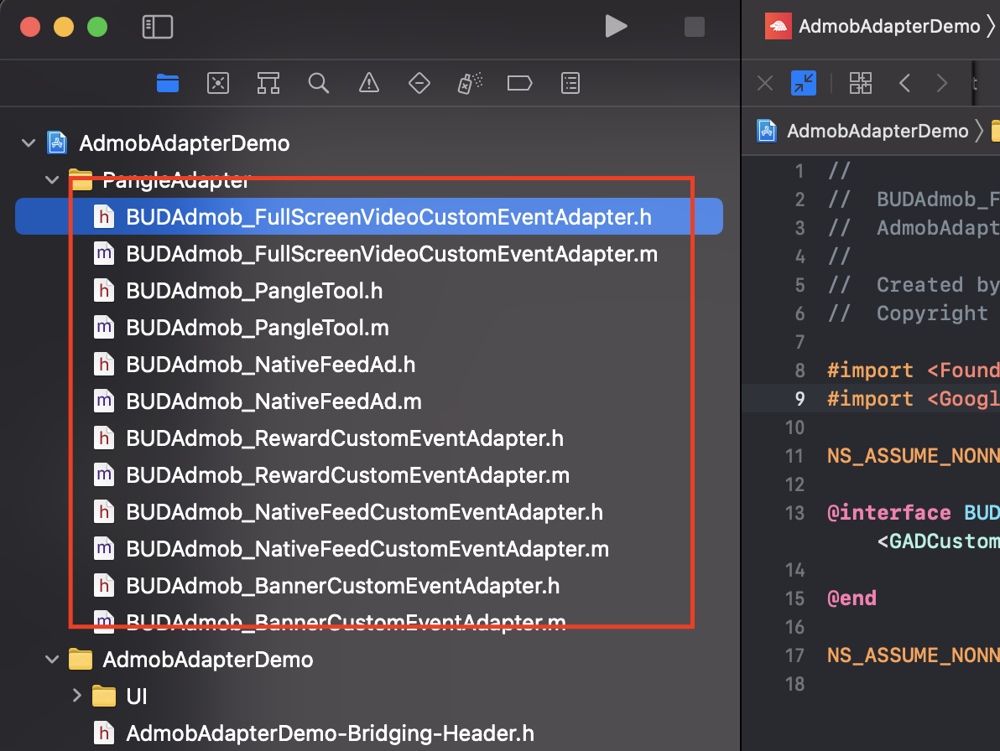

# AdMob Custom Event Adapter for Pangle

> [Admob](https://developers.google.com/admob/ios/quick-start) を先に設定してください。

* 導入に必要な手順
  * [Pangleプラットフォームのセットアップ](#setup-pangle)
  * [AdMobのmediationにPangleを追加](#add-pangle)
    * [各広告フォマートに対応するクラス名](#adapter-file)
  * [Pangle SDKとAdapterの導入と初期化](#import-pangle)
    * [Pangle SDKの導入と初期化](#import-sdk)
    * [Pangle Adaptersの導入](#import-adapter)
      * [CocoaPods](#import-adapter-pod)
      * [手動導入](#import-adapter-manual)
* [Swiftについて](#adapter-swift)
* [Demo](#adapter-demo)

<a name="setup-pangle"></a>
## Pangleプラットフォームのセットアップ
### Pangleアカウントを作成

- [Pangleアカウント](https://www.pangleglobal.com/jp)をお持ちでない場合は作成してください。


### Pangleでアプリケーションとプレースメントを作成

- `Apps` -> `+ Add App` をクリックして、メディエーション用のアプリを作成します。
<br>

<br>


<a name="app-id"></a>
- `app ID`付いたアプリが作成されます。
<br>


### 広告プレースメントを作成する
- `Ad Placements` -> `+ Add Ad Placement`をクリックして、メディエーション用のアプリに属するプレースメントを作成します。
<br>


- 広告の種類を選択して、作成を完了します
<br>


<a name="placementID"></a>
- `placement ID`付きのプレースメントが作成されます。
<br>


<a name="add-pangle"></a>
## AdMobのメディエーションにPangleを追加

### メディエーションを作成

- `Mediation` -> `CREATE MEDIATION GROUP` をクリックして、メディエーショングループを作成します。
<br>


- Pangle側で作成したものと同じ広告フォーマットを選択します。
<br>


- メディエーション用のAdmob広告ユニットを選択したら、`ADD CUSTOM EVENT`をクリックしてPangleで設定します。
<br>


- Adapterのクラス名を`Class Name`枠に追加します。
   - **Class Name**: Adapterのクラス名, 例：`BUDAdmob_RewardCustomEventAdapter`

- `{"placementID":"your slotID"}`を`Parameter`枠に追加します。

   - **Parameter**: {"placementID":"[your placement ID on Pangle](#placementID)"}のJSON形式, 例：`{"placementID": "1234567"}`

   - **必ずJSON形式でパラメータを設定してください。または、アダプターを自分でカスタマイズする必要があります。**
<br>


<a name="adapter-file"></a>
### 各広告フォマートに対応するクラス名

|  広告タイプ  |  Class Name  |
| ---- | ---- |
|  動画リワード広告  |  BUDAdmob_RewardCustomEventAdapter  |
|  インタースティシャル(フルスクリーン動画)広告  |  BUDAdmob_FullScreenVideoCustomEventAdapter  |
|  バナー広告 |  BUDAdmob_BannerCustomEventAdapter  |
|  ネイティブ広告  |  BUDAdmob_NativeFeedCustomEventAdapter  |


<a name="import-pangle"></a>
## Pangle SDKとAdapterの導入と初期化

<a name="import-sdk"></a>
### Pangle SDKの導入と初期化
Podfileに以下のように記入し `pod install`　または　`pod install` することでSDKを自動導入してください。

```
pod 'Ads-Global'
```

SDKの初期化
Pangle管理画面で作成した `APP ID` を引数に、 Pangle SDK を初期化してください。特別な理由が無い限り、
[UIApplicationDelegate application(_:didFinishLaunchingWithOptions:)](https://developer.apple.com/documentation/uikit/uiapplicationdelegate?language=swift#topics)に記述して下さい。

```swift
func application(_ application: UIApplication, didFinishLaunchingWithOptions launchOptions: [UIApplicationLaunchOptionsKey: Any]?) -> Bool {

    BUAdSDKManager.setAppID("your_app_id")

    return true
}
```

手動導入や初期パラメータの設定などは[SDKの導入](https://www.pangleglobal.com/help/doc/6034ac60511c57004360ff72)
と [SDKの初期化](https://www.pangleglobal.com/help/doc/6034ac73511c57004360ff76)をご参照ください。


<a name="import-adapter"></a>
### Pangle Adaptersの導入

<a name="#import-adapter-pod"></a>
#### CocoaPods (推奨)
Adapter v1.4.1 からCocoaPodsよりの導入をサポートします。それを使用するための前提条件は以下です。

- Pangle SDK 3.7.0.0 以降
- Google-Mobile-Ads-SDK 8.0.0 以降

Podfileに以下のように記入し `pod install`　または　`pod install` することでSDKを自動導入してください。

```
pod 'Pangle-adapter-for-admob'
```

<a name="#import-adapter-manual"></a>
#### 手動導入
Pangleプラットフォームから、`SDK Integration` -> `SDK download`からアダプターファイルをダウンロードしてください。
<br>

<br>


圧縮ファイルを解凍後にiOS用のアダプターファイルをアプリに導入すればコードを変更せずに使用できます。また、ユースケースに合わせてカスタマイズすることもできます。
* ネイティブ広告アダプターの[mapping](https://developers.google.com/admob/ios/native/native-custom-events#map_native_ads)をサポートするには、`BUDAdmob_NativeFeedAd.h`と`BUDAdmob_NativeFeedAd.m`をプロジェクトに追加する必要があります。




<a name="adapter-swift"></a>
## Swiftについて
- プロジェクトがSwiftに基づいている場合は、アダプタのヘッダーファイルをブリッジヘッダーファイルに追加してください。
<br>


<a name="adapter-demo"></a>
## Demo
- [Demo](https://github.com/bytedance/Bytedance-UnionAD/tree/master/Demo)から簡単な使用例を確認できます。
