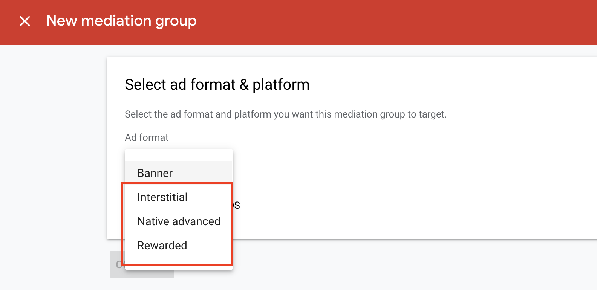

# AdMob Custom Event Adapter for Pangle

> [Admob](https://developers.google.com/admob/ios/quick-start) を先に設定してください。

* [Pangleプラットフォームのセットアップ](#setup-pangle)
* [AdMobのmediationにPangleを追加](#add-pangle)
* [Pangle SDKとAdapterの導入と初期化](#import-pangle)

## Pangleプラットフォームのセットアップ
### Pangleアカウントを作成する

- [Pangleアカウント](https://ad.oceanengine.com/union/media/login)をお持ちでない場合は作成してください。

### Pangleでアプリケーションとプレースメントを作成

- `Apps` -> `+ Add App` をクリックして、メディエーション用のアプリを作成します。
 

 

- `app ID`が付いたアプリが作成されます。
 

### 広告プレースメントを作成する
- `Ad Placements` -> `+ Add Ad Placement`をクリックして、メディエーション用のアプリに属するプレースメントを作成します。
 

- 広告の種類を選択して、作成を完了します
 

- `placement ID`付きのプレースメントが作成されます。
 

## AdMobのメディエーションにPangleを追加

### メディエーションを作成

- `Mediation` -> `CREATE MEDIATION GROUP` をクリックして、メディエーショングループを作成します。
 

- Pangle側で作成したものと同じ広告フォーマットを選択します。
 

- メディエーション用のAdmob広告ユニットを選択したら、`ADD CUSTOM EVENT`をクリックしてPangleで設定します。
 

- 必要な情報設定

 - Adapterのクラス名を`Class Name`枠に追加します。
   - **Class Name**: Adapterのクラス名, 例：`BUDAdmob_RewardCustomEventAdapter`

 - `{"placementID":"your slotID"}`を`Parameter`枠に追加します。

   - **Parameter**: {"placementID":"[your placement ID on Pangle](#placementID)"}のJSON形式, 例：`{"placementID": "1234567"}`
 

**必ずJSON形式でパラメータを設定してください。または、アダプターを自分でカスタマイズする必要があります。**

## Pangle SDKとAdapterの導入と初期化

### Pangle SDKの導入と初期化
- [SDKの導入](https://www.pangleglobal.com/help/doc/6034ac60511c57004360ff72)
と [SDKの初期化](https://www.pangleglobal.com/help/doc/6034ac73511c57004360ff76)に従ってPangle SDKのインテグレーションを完了します。

 * **[app ID](#app-id)を使用してPangleSDKを初期化してください。**

### Pangle Adaptersの導入
- Pangleプラットフォームから、`SDK Integration` -> `SDK download`をクリックすると、各広告フォーマット用のアダプターをダウンロードでき、アダプターファイルをアプリに導入すればコードを変更せずに使用できます。また、ユースケースに合わせてカスタマイズすることもできます。
 

 

- [Demo](./AdmobAdapterDemo)から簡単な使用例を確認できます。

- ネイティブ広告のアダプターの[mapping](https://developers.google.com/admob/ios/native/native-custom-events#map_native_ads)をサポートするには、下記2つのファイルをプロジェクトに追加する必要があります。
 

### Swiftについて
- プロジェクトがSwiftに基づいている場合は、アダプタのヘッダーファイルをブリッジヘッダーファイルに追加してください。
 

